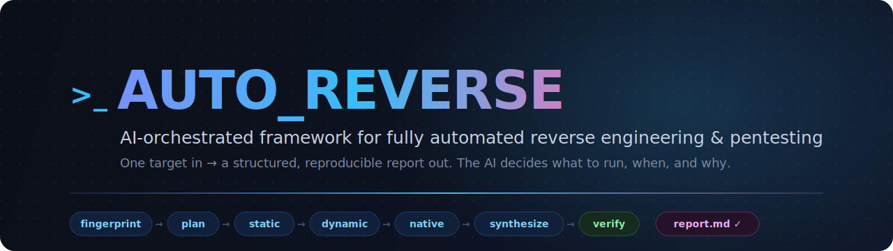
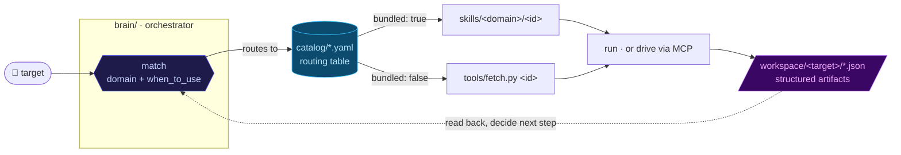
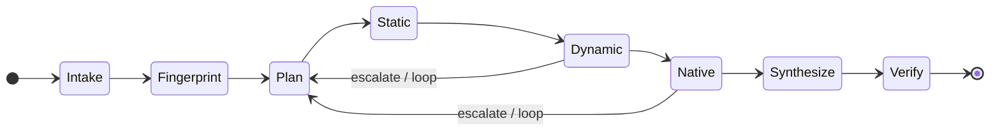

<div align="center">



<br>

[](LICENSE)
[](catalog/)
[](#-quick-start)
[](#b-clone-for-development--standalone-use)
[](#-extending)

<samp>**[What it is](#-what-it-is)** · **[How it works](#-how-it-works)** · **[Case study](#-case-study)** · **[Quick start](#-quick-start)** · **[Extending](#-extending)** · **[Responsible use](#-responsible-use)**</samp>

<sub>English · [简体中文](README.zh-CN.md)</sub>

</div>

<br>

Point auto_reverse at a single target — an Android `APK/AAB/XAPK`, an iOS app, a Windows `PE`, a native `.so/ELF`, or a web URL/API — and an AI **orchestrator** fingerprints it, plans an analysis chain, runs the right tools, confirms findings dynamically, and produces a structured, reproducible report.

> [!TIP]
> **Core idea — collect + route, fetch on demand.**
> auto_reverse is *not* a monolithic toolbox you install all at once. It is a large, ever-growing **capability catalog** plus an **analysis brain** that, for each target, picks only the handful of tools that target actually needs and pulls them into the project on demand — never touching your global environment.

```console
$ # tell Claude Code, with a target in hand:
> reverse this APK and find the request-signing algorithm

  ◇ fingerprint  → Android · Kotlin/R8 · OkHttp pinning · libsign.so (arm64)
  ◇ plan         → 6 steps · playbook: android-native-sign
  ◇ static       → endpoint POST /v2/order · sign() @ com.app.net.Signer → JNI
  ◇ dynamic      → frida-mitm: x-sign = HMAC_SHA256(sorted_params, k) ; k from native
  ◇ native       → ghidra: key derived in Java_..._init  (extracted)
  ◇ verify       → replayed request → 200 OK ✓
  ✔ report.md + reproducible PoC written to workspace/<target>/
```

## 🧩 What it is

auto_reverse has two layers — a brain that decides, and a catalog that supplies.

<table>
<tr>
<td width="50%" valign="top">

### 🧠 The brain · `brain/`

An AI orchestrator. It runs an evidence-driven **state machine**, writes each phase's result as a structured JSON artifact, and reads those artifacts back to decide the next step.

➜ decides **when & why**

</td>
<td width="50%" valign="top">

### 📚 The catalog · `catalog/`

An extensible inventory of capabilities (skills, tools, MCP servers, scripts, agents). Each entry declares a `domain` and a `when_to_use` line the brain matches against. Entries are independent — you never need them all.

➜ decides **what**

</td>
</tr>
</table>

Everything else (`skills/`, `tools/`, `mcp/`) exists to serve those two layers.

### What it covers

auto_reverse spans **both** sides of the offensive/analysis spectrum:

- 🔬 **Reverse engineering** — Android (Java/Kotlin, native `.so`, Flutter, Unity/IL2CPP, React Native/Hermes, packers), iOS, Windows PE/.NET, and general native binaries (IDA/Ghidra/angr/unidbg).
- 🛡️ **Penetration testing & offensive security** — recon and scanning, content/API/directory bruteforce, fuzzing, web & API vulnerability testing, anti-bot / anti-fraud / WAF analysis, exploitation, C2, and network forensics.
- 🤖 **Agent-driven automation (MCP)** — many tools ship an MCP server so the brain can *drive* them in an autonomous read→act loop instead of just emitting one-shot commands.

<div align="center">
<br>
<sub><b>750+ routed capabilities · 27 bundled skills</b> — a floor, not a ceiling; it grows continuously</sub>

| 🌐 Web | ⚙️ Native | 🔌 MCP | 🤖 Android | 🍎 iOS | 📦 Frameworks | 🪟 Windows |
|:---:|:---:|:---:|:---:|:---:|:---:|:---:|
| **360+** | **135+** | **110+** | **70+** | **35+** | **17+** | **12+** |

<sub>Already reversed a specific app/SDK? See the <b><a href="TARGETS.md">🎯 Target Coverage Index</a></b> — one table of every target with a dedicated asset (Bilibili, PerimeterX, Castle.io, Akamai, Ruishu, …).</sub>

</div>

## ⚙️ How it works



The brain advances through a 7-phase state machine; **artifacts are the only interface between phases**, so the run is interruptible and resumable:



1. **Fingerprint** the target to learn its type, framework, and protections.
2. **Route** through `catalog/` by matching `domain` + `when_to_use`.
3. **Provision** the chosen capability — use it if bundled, otherwise fetch it on demand (into the project's `.venv` or `tools/bin/`).
4. **Drive** it (preferably via its MCP server), write results to `workspace/<target>/`, read them back, and iterate until the report is reproducible.

## 🎬 Case study

A real, end-to-end run, fully desensitized — the worked artifacts live in
[`cases/dailypay-castleio-android/`](cases/dailypay-castleio-android/).

> **Target:** DailyPay v48.0.0 (Android, React Native + Hermes + Expo) →
> **Castle.io** anti-bot SDK `io.castle.android` **v3.1.1** ("Highwind": 70 obfuscated
> pure-Java classes, no `.so`).
> **Goal:** reproduce the `X-Castle-Request-Token` request header.

| Phase | Outcome |
|---|---|
| 🔎 **Fingerprint** | RN/Hermes app; routed to the **Castle SDK** branch (anti-bot SDK takes precedence over the RN framework row). |
| 🧭 **Plan** | Selected the native-Java token playbook; entry `Castle.createRequestToken()` → `Highwind.token()`. |
| 🔬 **Static** | Located the token assembly path through the obfuscated `io.castle.highwind.android` engine. |
| 📡 **Dynamic** | Real-device capture of `X-Castle-Request-Token` (valid 120 s, one per request) confirmed the field shape. |
| 🧩 **Synthesize** | Recovered the full algorithm: hex-domain assembly → nibble/byte XOR layers → `unhex` → base64url. |
| ✅ **Verify** | Re-generated tokens accepted end-to-end — and surfaced a **key drift** vs. the public open-source material (v2.6.0 / token v11), with real-device measurements taken as authoritative. |

**Result:** the Castle Android SDK v3.1.1 token algorithm **fully reverse-engineered and
end-to-end verified**. → Read the full write-up:
[**`report.md`**](cases/dailypay-castleio-android/report.md).

## 🚀 Quick start

<details open>
<summary><b>A) As a Claude Code plugin</b> &nbsp;·&nbsp; <i>recommended for users</i></summary>

<br>

The repo ships a plugin manifest (`.claude-plugin/marketplace.json`). Add it as a marketplace and install the `auto-reverse` plugin, which registers the **brain** orchestrator skill:

```
/plugin marketplace add <your-org>/auto_reverse
/plugin install auto-reverse
```

Then just tell Claude Code what you want, e.g. *"reverse this APK"* or *"find the signing algorithm for this API"*, and point it at the target — the brain takes over.

</details>

<details>
<summary><b>B) Clone for development / standalone use</b></summary>

<br>

```bash
git clone <repo-url> auto_reverse
cd auto_reverse
```

**1. Install the base runtimes once** (prerequisites for many tools):

| Runtime | Min version | Why |
|---|---|---|
| **Python** | 3.10+ | adapters, `fetch.py` / `doctor.py` |
| **JDK** | 17+ (21 for Ghidra 12) | jadx / apktool / ghidra / unidbg |
| **Node.js** | 18+ | apk-mitm / playwright / frida bridges |
| **adb / platform-tools** | latest | Android device interaction |

```bash
python --version && java -version && node --version && adb version
```

**2. Run setup** — generates `.mcp.json` and runs a health check:

```powershell
./setup.ps1        # Windows
```
```bash
./setup.sh         # macOS / Linux
```

Setup renders `mcp/mcp.template.json` into a machine-specific `.mcp.json` (substituting your real `python` and tools paths), validates it, then runs `doctor.py`. `.mcp.json` is **generated, not committed** (it's gitignored).

> [!NOTE]
> If you keep your reversing tools in a shared external directory instead of `<project>/tools/bin`, point setup at it:
> ```powershell
> ./setup.ps1 -ToolsRoot 'D:/my-tools'           # or set $env:AUTO_REVERSE_TOOLS
> ```
> ```bash
> AUTO_REVERSE_TOOLS=/opt/re-tools ./setup.sh
> ```

**3. Provision tools on demand:**

```bash
python tools/doctor.py --missing      # what's missing + the fetch command for each
python tools/fetch.py --list          # everything fetchable
python tools/fetch.py jadx            # download jadx into tools/bin/jadx/
python tools/fetch.py mitmproxy       # install into the project .venv
```

`fetch.py` has zero third-party dependencies (stdlib only) and installs only what you ask for, inside the project — your global environment stays clean. See [`tools/INSTALL.md`](tools/INSTALL.md) for the full guide and per-OS notes.

</details>

## 🗂️ Project layout

```
AGENTS.md         👈 start here if you're an AI/agent — the map + operating rules
brain/            orchestrator: SKILL.md (state machine), decision-tree.md, playbooks/, artifacts/ (JSON schemas)
catalog/          capability index (*.yaml) — the routing table  ·  SCHEMA.md + validate.py
                  targets.yaml + targets.py — target-coverage index (→ TARGETS.md)
TARGETS.md        🎯 generated index of every already-reversed target (do not hand-edit)
skills/           bundled skill libraries, by domain (android/ ios/ native/ web/ windows/ common/)
tools/            auto_reverse.py (headless from-zero driver) + oracle.py (Phase-7 verify) + smoketest.py (catalog reliability)
                  ui_exercise.py (unattended UI driver) + ghidra_scripts/ + registry.yaml + doctor.py + fetch.py
                  fingerprint.py + hermes_strings.py + workspace.py + adapters/
mcp/              mcp.template.json (rendered into .mcp.json by setup)
cases/            sanitized end-to-end case studies (worked examples)
config/           default.yaml (+ local.yaml override, gitignored)
workspace/        per-target working dirs + artifacts (gitignored) — see workspace/README.md
docs/             documentation assets (banner, images)
.github/          CI workflow + issue/PR templates + CONTRIBUTING / SECURITY / CODE_OF_CONDUCT
setup.ps1 / .sh   one-shot bootstrap
```

## 🔌 Extending

Capabilities are **data, not code**: in the common case you add a tool by appending one entry to a catalog file — the brain picks it up automatically. There are four kinds of extension, from simplest to most involved.

<details open>
<summary><b>1. Register an on-demand capability</b> &nbsp;·&nbsp; <i>the common case</i></summary>

<br>

Most additions are just a catalog entry pointing at an external tool the brain fetches when needed. Pick the file for the domain (`catalog/android.yaml`, `web.yaml`, `native.yaml`, `windows.yaml`, `ios.yaml`, `frameworks.yaml`, or `mcp.yaml`) and add an entry:

```yaml
- id: my-tool                 # unique, kebab-case
  name: My Tool
  type: tool                  # skill | mcp | tool | script | agent | platform
  domain: web                 # android | ios | native | windows | web | framework
  capability: One-line description of what it does.
  when_to_use: |              # ★ the routing key — the brain reads THIS to decide when to call it
    When the target needs <specific situation>; better than <alternative> for <reason>.
  source: https://github.com/owner/my-tool
  install: "pip install my-tool"     # or "npm i -g ...", "git clone + ...", or a release URL
  bundled: false              # false = fetched on demand; true = shipped in this repo (see §2)
  status: active              # active | slowed | archived | commercial
  # optional:
  platform: [web]
  alt_to: [other-tool]        # what it replaces or enhances
  note: anything worth flagging
```

The single most important field is **`when_to_use`** — it is how the brain routes. Make it concrete: name the situation, the target type, and when to prefer this over alternatives. See [`catalog/SCHEMA.md`](catalog/SCHEMA.md) for the full field reference.

That's it — for `bundled: false`, you're done. The brain will `fetch.py`-install it (via `install`) the first time a target needs it.

</details>

<details>
<summary><b>2. Bundle a skill in-repo</b> &nbsp;·&nbsp; <code>bundled: true</code></summary>

<br>

If your capability is a reusable **workflow/methodology** (not just an external binary) and you want it shipped with the project, make it a skill:

1. Create `skills/<domain>/<id>/SKILL.md` with YAML frontmatter:
   ```markdown
   ---
   name: my-skill
   description: What it does and the trigger scenarios / keywords that should invoke it.
   ---

   # My Skill

   Step-by-step methodology, tool invocations, and known pitfalls.
   ```
2. Put any helper files alongside it (e.g. `references/`, scripts, templates).
3. Add the catalog entry from §1 with `type: skill` and `bundled: true`.

Rule of thumb: **a skill encodes *how* to do something** (tool usage + gotchas); **the brain decides *when and why*.** Keep that separation — don't put orchestration logic in a skill.

</details>

<details>
<summary><b>3. Register an MCP server</b> &nbsp;·&nbsp; <i>agent-driven tools</i></summary>

<br>

If a tool exposes an MCP server, the brain can drive it autonomously. Add it to `catalog/mcp.yaml`, and if it should be wired up by `setup`, add it to the template:

- Edit `mcp/mcp.template.json` and add a server block, using the `${PYTHON}` and `${TOOLS_ROOT}` placeholders so it stays portable across machines:
  ```json
  "my-mcp": {
    "command": "${PYTHON}",
    "args": ["${TOOLS_ROOT}/my-mcp/server.py", "--transport", "stdio"]
  }
  ```
- Re-run `./setup.ps1` / `./setup.sh` to regenerate `.mcp.json`, then approve the server in Claude Code (`/mcp`).

For an `mcp`-type catalog entry, `bundled: true` means "this repo already ships the MCP config" (via the template), **not** that there's a `skills/` directory.

</details>

<details>
<summary><b>4. Add a tool to the install registry</b></summary>

<br>

`tools/registry.yaml` is the curated list `doctor.py` checks and `fetch.py` can install. Add an entry under the right section (e.g. `android_static`, `native`, `web`) with its `install`, `url`, and `check` (detection) command so the health check and on-demand fetch both know about it.

</details>

#### Validate before committing

```bash
python catalog/validate.py     # checks required fields + globally unique ids
```

> [!IMPORTANT]
> **Language policy:** auto_reverse is an English-only international project. Write all entries, skills, docs, and commit messages in English.

## ⚠️ Responsible use

auto_reverse includes powerful offensive and analysis capabilities (fuzzers, scanners, exploitation and C2 integrations, anti-bot bypass, instrumentation). Use them **only** against systems you own or are explicitly authorized to test — authorized security research, penetration-testing engagements, CTFs, interoperability, and defensive work.

- Never write real credentials, tokens, or PII into reports or case records; the brain desensitizes by policy.
- The brain stops and asks for a human when a target appears to be for unauthorized or illegal use.
- You are responsible for complying with all laws and contractual terms that apply to your target.

<div align="center">
<br>
<sub>Built for <a href="https://claude.com/claude-code">Claude Code</a> · Licensed under <a href="LICENSE">MIT</a> © the auto_reverse authors</sub>
</div>
