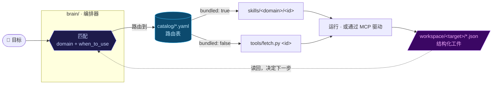
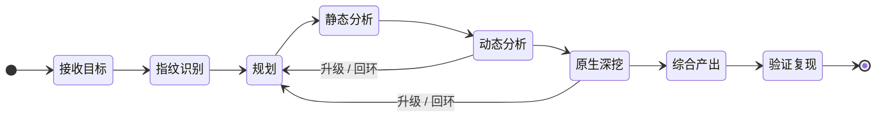

<div align="center">


<br>

[](https://github.com/warterbili/AUTO_REVERSE/actions/workflows/validate.yml)
[](LICENSE)
[](catalog/)
[](#-快速上手)
[](#b-克隆用于开发--独立使用)
[](https://github.com/warterbili/AUTO_REVERSE/stargazers)
[](#-扩展项目)

<samp>**[是什么](#-是什么)** · **[如何运作](#-如何运作)** · **[实战案例](#-实战案例)** · **[快速上手](#-快速上手)** · **[扩展项目](#-扩展项目)** · **[负责任使用](#-负责任使用)**</samp>

<sub>[English](README.md) · 简体中文</sub>

</div>

<br>

> 📌 本文档为中文对照版，方便阅读。项目正式文档以 [English README](README.md) 为准；提交到仓库的目录条目、技能、文档与提交信息请统一使用英文（详见[语言政策](#扩展项目)）。

把 auto_reverse 对准一个目标 —— 一个安卓 `APK/AAB/XAPK`、一个 iOS 应用、一个 Windows `PE`、一个原生 `.so/ELF`，或者一个 Web URL/API —— AI **编排器（orchestrator）** 会自动对它做指纹识别、规划分析链路、调用合适的工具、动态确认发现，并产出一份结构化、可复现的报告。

> [!TIP]
> **核心理念 —— 收集 + 路由，按需拉取（collect + route, fetch on demand）。**
> auto_reverse **不是**一个需要一次性全装好的庞大工具箱。它是一份持续增长的**能力目录（catalog）**，外加一个**分析大脑（brain）**：针对每个目标，只挑出那个目标真正需要的少数几个工具，并按需拉进项目里 —— 绝不污染你的全局环境。

```console
$ # 手里拿着目标，直接告诉 Claude Code：
> reverse this APK and find the request-signing algorithm
  （翻译：逆向这个 APK，找出请求签名算法）

  ◇ fingerprint  → 安卓 · Kotlin/R8 · OkHttp 证书绑定 · libsign.so (arm64)
  ◇ plan         → 6 步 · 选用 playbook：android-native-sign
  ◇ static       → 接口 POST /v2/order · sign() 位于 com.app.net.Signer → 进入 JNI
  ◇ dynamic      → frida-mitm 抓包：x-sign = HMAC_SHA256(排序后的参数, k)；k 来自 native
  ◇ native       → ghidra：密钥在 Java_..._init 中派生（已提取）
  ◇ verify       → 重放请求 → 200 OK ✓
  ✔ 已生成 report.md + 可复现 PoC，写入 workspace/<target>/
```

## 🧩 是什么

auto_reverse 分两层 —— 一个负责决策的大脑，一个负责供给的目录。

<table>
<tr>
<td width="50%" valign="top">

### 🧠 大脑 · `brain/`

一个 AI 编排器。它运行一个证据驱动的**状态机**，把每个阶段的结果写成结构化的 JSON 工件（artifact），再读回这些工件来决定下一步。

➜ 决定 **何时 & 为什么做**

</td>
<td width="50%" valign="top">

### 📚 目录 · `catalog/`

一份可扩展的能力清单（技能、工具、MCP 服务、脚本、智能体）。每个条目声明一个 `domain`（领域）和一行 `when_to_use`（何时使用），供大脑匹配。条目彼此独立 —— 你永远不需要全部。

➜ 决定 **用什么**

</td>
</tr>
</table>

其余的一切（`skills/`、`tools/`、`mcp/`）都是为这两层服务的。

### 覆盖范围

auto_reverse **同时覆盖**攻击/分析光谱的两端：

- 🔬 **逆向工程** —— 安卓（Java/Kotlin、原生 `.so`、Flutter、Unity/IL2CPP、React Native/Hermes、加固壳）、iOS、Windows PE/.NET，以及通用原生二进制（IDA/Ghidra/angr/unidbg）。
- 🛡️ **渗透测试 & 攻击性安全** —— 信息侦察与扫描、内容/API/目录爆破、模糊测试（fuzzing）、Web 与 API 漏洞测试、反爬/反欺诈/WAF 分析、漏洞利用、C2，以及网络取证。
- 🤖 **智能体驱动自动化（MCP）** —— 许多工具自带 MCP 服务，大脑可以在「读取→行动」的自主循环里**直接驱动**它们，而不只是一次性吐出几条命令。

<div align="center">
<br>
<sub><b>750+ 个可路由能力 · 28 个内置技能</b> —— 这是下限而非上限，会持续增长</sub>

| 🌐 Web | ⚙️ 原生 | 🔌 MCP | 🤖 安卓 | 🍎 iOS | 📦 框架 | 🪟 Windows |
|:---:|:---:|:---:|:---:|:---:|:---:|:---:|
| **360+** | **135+** | **110+** | **70+** | **35+** | **17+** | **12+** |

<sub>某个 App/SDK 是否已经逆过？查 <b><a href="TARGETS.md">🎯 目标覆盖索引</a></b> —— 一张表列出所有"有专属资产"的目标（Bilibili、PerimeterX、Castle.io、Akamai、瑞数……）。</sub>

</div>

## ⚙️ 如何运作



大脑沿着一个 7 阶段状态机推进；**工件是各阶段之间唯一的接口**，因此整个流程可中断、可续跑：



1. **指纹识别（Fingerprint）** 目标，搞清它的类型、框架与防护。
2. **路由（Route）** —— 在 `catalog/` 里按 `domain` + `when_to_use` 匹配。
3. **按需准备（Provision）** —— 选中的能力，已内置就直接用，没内置就按需拉取（装进项目的 `.venv` 或 `tools/bin/`）。
4. **驱动（Drive）** —— 尽量通过它的 MCP 服务驱动，把结果写进 `workspace/<target>/`，再读回，反复迭代，直到报告可复现。

## 🎬 实战案例

一次真实、端到端、已完全脱敏的运行 —— 完整工件见
[`cases/dailypay-castleio-android/`](cases/dailypay-castleio-android/)。

> **目标：** DailyPay v48.0.0（安卓，React Native + Hermes + Expo）→
> **Castle.io** 反爬 SDK `io.castle.android` **v3.1.1**（代号 "Highwind"：70 个混淆过的纯 Java 类，无 `.so`）。
> **目的：** 复现 `X-Castle-Request-Token` 请求头。

| 阶段 | 结果 |
|---|---|
| 🔎 **指纹识别** | RN/Hermes 应用；路由到 **Castle SDK** 分支（反爬 SDK 优先级高于 RN 框架那一行）。 |
| 🧭 **规划** | 选用「原生 Java token」playbook；入口 `Castle.createRequestToken()` → `Highwind.token()`。 |
| 🔬 **静态分析** | 在混淆的 `io.castle.highwind.android` 引擎里定位 token 的拼装路径。 |
| 📡 **动态分析** | 真机抓取 `X-Castle-Request-Token`（有效期 120 秒，每请求一枚），确认字段形态。 |
| 🧩 **综合产出** | 还原完整算法：十六进制域拼装 → nibble/byte 异或层 → `unhex` → base64url。 |
| ✅ **验证复现** | 重新生成的 token 端到端被接受 —— 并发现相对公开开源资料（v2.6.0 / token v11）存在 **密钥漂移（key drift）**，以真机实测为准。 |

**结果：** Castle 安卓 SDK v3.1.1 的 token 算法**完全逆向并端到端验证通过**。→ 阅读完整报告：
[**`report.md`**](cases/dailypay-castleio-android/report.md)。

## 🚀 快速上手

<details open>
<summary><b>A）作为 Claude Code 插件使用</b> &nbsp;·&nbsp; <i>推荐给普通用户</i></summary>

<br>

仓库自带一个插件清单（`.claude-plugin/marketplace.json`）。把它添加为一个市场（marketplace），再安装 `auto-reverse` 插件，即可注册**大脑**编排器技能：

```
/plugin marketplace add warterbili/AUTO_REVERSE
/plugin install auto-reverse
```

之后直接用大白话告诉 Claude Code 你想干嘛，例如 *“reverse this APK”（逆向这个 APK）* 或 *“find the signing algorithm for this API”（找出这个 API 的签名算法）*，并把目标指给它 —— 接下来交给大脑。

</details>

<details>
<summary><b>B）克隆用于开发 / 独立使用</b></summary>

<br>

```bash
git clone https://github.com/warterbili/AUTO_REVERSE.git auto_reverse
cd auto_reverse
```

**1. 一次性安装基础运行时**（许多工具的前置依赖）：

| 运行时 | 最低版本 | 用途 |
|---|---|---|
| **Python** | 3.10+ | 适配器、`fetch.py` / `doctor.py` |
| **JDK** | 17+（Ghidra 12 需 21） | jadx / apktool / ghidra / unidbg |
| **Node.js** | 18+ | apk-mitm / playwright / frida 桥接 |
| **adb / platform-tools** | 最新 | 与安卓设备交互 |

```bash
python --version && java -version && node --version && adb version
```

**2. 运行 setup** —— 生成 `.mcp.json` 并做一次健康检查：

```powershell
./setup.ps1        # Windows
```
```bash
./setup.sh         # macOS / Linux
```

setup 会把 `mcp/mcp.template.json` 渲染成一份本机专属的 `.mcp.json`（替换成你真实的 `python` 与工具路径），校验它，然后运行 `doctor.py`。`.mcp.json` 是**自动生成、不提交**的（已被 gitignore 忽略）。

> [!NOTE]
> 如果你的逆向工具放在一个共享的外部目录里，而不是 `<project>/tools/bin`，可以让 setup 指向它：
> ```powershell
> ./setup.ps1 -ToolsRoot 'D:/my-tools'           # 或设置 $env:AUTO_REVERSE_TOOLS
> ```
> ```bash
> AUTO_REVERSE_TOOLS=/opt/re-tools ./setup.sh
> ```

**3. 按需拉取工具：**

```bash
python tools/doctor.py --missing      # 缺什么 + 每个的拉取命令
python tools/fetch.py --list          # 所有可拉取的东西
python tools/fetch.py jadx            # 下载 jadx 到 tools/bin/jadx/
python tools/fetch.py mitmproxy       # 安装进项目的 .venv
```

`fetch.py` **零第三方依赖**（仅用标准库），只装你点名要的东西，且装在项目内部 —— 你的全局环境保持干净。完整指南与各操作系统注意事项见 [`tools/INSTALL.md`](tools/INSTALL.md)。

</details>

## 🗂️ 项目结构

```
AGENTS.md         👈 AI/agent 从这里开始 —— 项目地图 + 操作规则
brain/            编排器：SKILL.md（状态机）、decision-tree.md、playbooks/、artifacts/（JSON schema）
catalog/          能力索引（*.yaml）—— 路由表  ·  SCHEMA.md + validate.py
                  targets.yaml + targets.py —— 目标覆盖索引（→ TARGETS.md）
TARGETS.md        🎯 自动生成的"已逆向目标"总览表（请勿手改）
skills/           内置技能库，按领域分（android/ ios/ native/ web/ windows/ common/）
tools/            auto_reverse.py（无头一键驱动）+ oracle.py（Phase 7 验证）+ smoketest.py（catalog 可靠性）
                  ui_exercise.py（无人值守 UI 驱动）+ ghidra_scripts/ + registry.yaml + doctor.py + fetch.py
                  fingerprint.py + hermes_strings.py + workspace.py + adapters/
mcp/              mcp.template.json（由 setup 渲染成 .mcp.json）
cases/            脱敏后的端到端案例研究（实战范例）
config/           default.yaml（+ local.yaml 覆盖项，已 gitignore）
workspace/        每个目标的工作目录 + 工件（已 gitignore）—— 见 workspace/README.md
docs/             文档资源（横幅、图片）
.github/          CI 工作流 + issue/PR 模板 + CONTRIBUTING / SECURITY / CODE_OF_CONDUCT
setup.ps1 / .sh   一键引导脚本
```

## 🔌 扩展项目

能力是**数据，而非代码**：常见情况下，你只要往某个目录文件里追加一个条目，大脑就会自动认到它。扩展分四种，从最简单到最复杂排列。

<details open>
<summary><b>1. 注册一个按需拉取的能力</b> &nbsp;·&nbsp; <i>最常见的情况</i></summary>

<br>

绝大多数新增就是一个指向外部工具的目录条目，需要时由大脑拉取。挑对应领域的文件（`catalog/android.yaml`、`web.yaml`、`native.yaml`、`windows.yaml`、`ios.yaml`、`frameworks.yaml` 或 `mcp.yaml`），追加一个条目：

```yaml
- id: my-tool                 # 唯一，kebab-case 短横线命名
  name: My Tool
  type: tool                  # skill | mcp | tool | script | agent | platform
  domain: web                 # android | ios | native | windows | web | framework
  capability: 一句话说明它能干什么。
  when_to_use: |              # ★ 路由关键字段 —— 大脑读「这一行」来决定何时调用它
    当目标遇到 <具体场景> 时；在 <某原因> 下比 <某替代品> 更合适。
  source: https://github.com/owner/my-tool
  install: "pip install my-tool"     # 或 "npm i -g ..."、"git clone + ..."、或一个 release 链接
  bundled: false              # false = 按需拉取；true = 随本仓库内置（见 §2）
  status: active              # active | slowed | archived | commercial
  # 可选：
  platform: [web]
  alt_to: [other-tool]        # 它替代或增强了谁
  note: 任何值得标注的信息
```

最重要的字段是 **`when_to_use`** —— 这就是大脑路由的依据。要写得具体：点明场景、目标类型，以及何时该优先选它而非替代品。完整字段说明见 [`catalog/SCHEMA.md`](catalog/SCHEMA.md)。

就这样 —— 对 `bundled: false` 来说，到此就完事了。第一次有目标需要它时，大脑会用 `fetch.py` 按 `install` 把它装上。

</details>

<details>
<summary><b>2. 把一个技能内置进仓库</b> &nbsp;·&nbsp; <code>bundled: true</code></summary>

<br>

如果你的能力是一套可复用的**工作流/方法论**（而不只是一个外部二进制），并且你想让它随项目一起发布，那就把它做成一个技能：

1. 创建 `skills/<domain>/<id>/SKILL.md`，带 YAML frontmatter：
   ```markdown
   ---
   name: my-skill
   description: 它能做什么，以及应触发它的场景 / 关键词。
   ---

   # My Skill

   分步方法论、工具调用方式、以及已知的坑。
   ```
2. 把任何辅助文件放在旁边（如 `references/`、脚本、模板）。
3. 加上 §1 的目录条目，设 `type: skill` 且 `bundled: true`。

经验法则：**技能编码的是「怎么做」**（工具用法 + 坑）；**大脑决定「何时做、为什么做」。** 守住这条分界 —— 别把编排逻辑塞进技能里。

</details>

<details>
<summary><b>3. 注册一个 MCP 服务</b> &nbsp;·&nbsp; <i>智能体驱动的工具</i></summary>

<br>

如果某个工具暴露了 MCP 服务，大脑就能自主驱动它。把它加进 `catalog/mcp.yaml`；如果还希望由 `setup` 自动接好线，再加进模板：

- 编辑 `mcp/mcp.template.json`，加一个服务块，用 `${PYTHON}` 和 `${TOOLS_ROOT}` 占位符以便跨机器移植：
  ```json
  "my-mcp": {
    "command": "${PYTHON}",
    "args": ["${TOOLS_ROOT}/my-mcp/server.py", "--transport", "stdio"]
  }
  ```
- 重新跑 `./setup.ps1` / `./setup.sh` 重新生成 `.mcp.json`，然后在 Claude Code 里批准该服务（`/mcp`）。

对于 `mcp` 类型的目录条目，`bundled: true` 表示「本仓库已经自带了 MCP 配置」（通过模板），**并不**代表存在一个 `skills/` 目录。

</details>

<details>
<summary><b>4. 把工具加进安装注册表</b></summary>

<br>

`tools/registry.yaml` 是 `doctor.py` 检查、`fetch.py` 可安装的那份精选清单。在合适的分区下（如 `android_static`、`native`、`web`）加一个条目，写上它的 `install`、`url` 和 `check`（检测）命令，这样健康检查和按需拉取就都认得它了。

</details>

#### 提交前先校验

```bash
python catalog/validate.py     # 检查必填字段 + 全局唯一 id
```

> [!IMPORTANT]
> **语言政策：** auto_reverse 是一个纯英文的国际化项目。所有条目、技能、文档与提交信息**请一律用英文书写**。（本中文 README 仅作对照阅读之用。）

## ⚠️ 负责任使用

auto_reverse 包含强大的攻击性与分析能力（fuzzer、扫描器、漏洞利用与 C2 集成、反爬绕过、插桩等）。**只能**对你拥有、或获得明确授权测试的系统使用 —— 即授权安全研究、渗透测试合约、CTF、互操作性研究与防御性工作。

- 绝不把真实凭据、令牌或个人信息（PII）写进报告或案例记录；大脑会按策略脱敏。
- 当目标看起来用于未授权或非法用途时，大脑会停下并请求人工介入。
- 你需自行遵守适用于你目标的一切法律与合同条款。

<div align="center">
<br>
<sub>为 <a href="https://claude.com/claude-code">Claude Code</a> 打造 · 基于 <a href="LICENSE">MIT</a> 许可证 © auto_reverse 作者们</sub>
</div>
